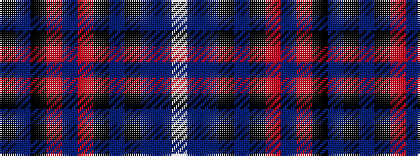

KBKRBRKBKBBW

It is a 12 stripe tartan.

<figure class="pat-woven">

<figcaption>idealised sample</figcaption>
</figure>

## Colour Sequence



## Tartans with this colour sequence

| Tartans |
|---------------|
| [Earthrise](/variants/s12/k4n6k4o4n29o6k64db10k4db6t4w2/)|
||
