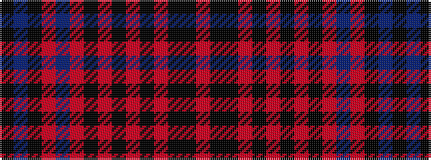

KBKRBRKRKRKRKKR

It is a 15 stripe tartan.

<figure class="pat-woven">

<figcaption>idealised sample</figcaption>
</figure>

## Colour Sequence



## Tartans with this colour sequence

| Tartans |
|---------------|
| [James (Welsh Name)](/variants/s15/r11k1k3r6k1r6k3r4k7r11db1r11k7db2k4~x2/)|
||
