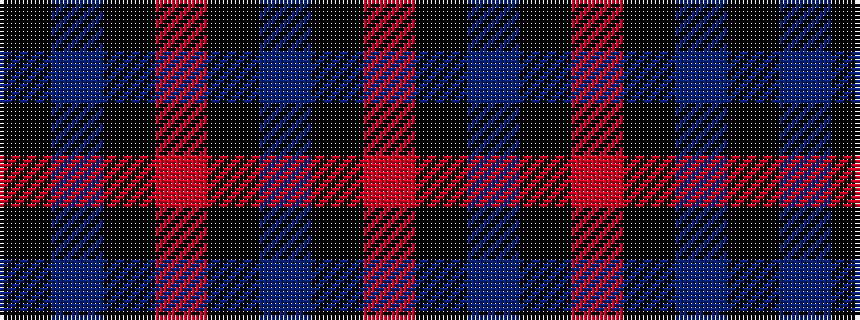

KBKRKBKR

It is a 8 stripe tartan.

<figure class="pat-woven">

<figcaption>idealised sample</figcaption>
</figure>

## Colour Sequence



## Tartans with this colour sequence

| Tartans |
|---------------|
| [Black and Red](/setts/s8/r25k2n4k2r8k31db32k8/)|
||
