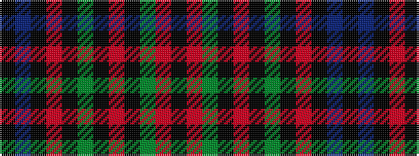

KBKRKGKRKGRK

It is a 12 stripe tartan.

<figure class="pat-woven">

<figcaption>idealised sample</figcaption>
</figure>

## Colour Sequence



## Tartans with this colour sequence

| Tartans |
|---------------|
| [Skene (Maclan)](/setts/s12/k4db24k4r3k4dg24k4r3k4dg24r3k4~x2/)|
||
