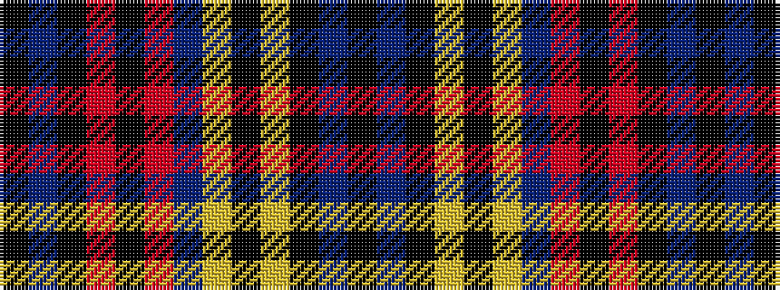

KBKRKRBYKYKBK

It is a 13 stripe tartan.

<figure class="pat-woven">

<figcaption>idealised sample</figcaption>
</figure>

## Colour Sequence



## Tartans with this colour sequence

| Tartans |
|---------------|
| [Robieson QAHS](/setts/s13/k1b1k8r1k1r8b1ly8k1ly1k8b1k1~x6/)|
||
| [Robieson QAHS (Fashion)](/setts/s13/k1db1k8r1k1r8db1ly8k1ly1k8db1k1~x6/)|
||
