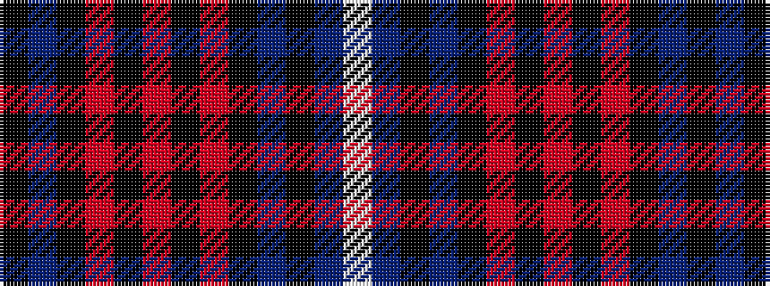

KBKRKRKRKBKBW

It is a 13 stripe tartan.

<figure class="pat-woven">

<figcaption>idealised sample</figcaption>
</figure>

## Colour Sequence



## Tartans with this colour sequence

| Tartans |
|---------------|
| [Kennedy](/setts/s13/k2b4k14r3k6o2k2o2k10db6k2db3w1~x2/)|
||
