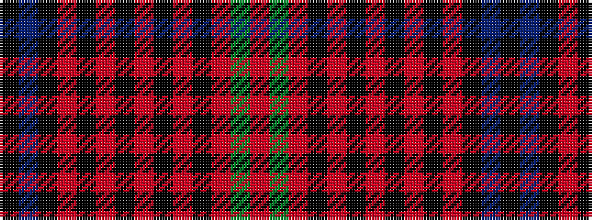

KBKRKRKRKRKRGR

It is a 14 stripe tartan.

<figure class="pat-woven">

<figcaption>idealised sample</figcaption>
</figure>

## Colour Sequence



## Tartans with this colour sequence

| Tartans |
|---------------|
| [Black (Hebridean) (Artefact)](/setts/s14/k17db3k4r1k17r2k3r2k17r3k17r3g3r3~x2/)|
||
