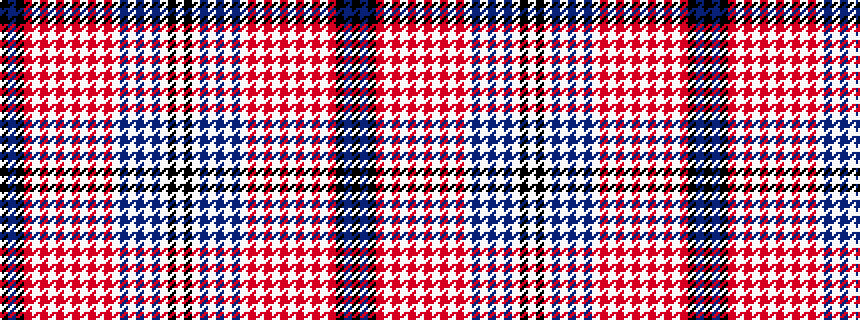

KBKRWRWRWRWRWRWBWBWBWKW

It is a 23 stripe tartan.

<figure class="pat-woven">

<figcaption>idealised sample</figcaption>
</figure>

## Colour Sequence



## Tartans with this colour sequence

| Tartans |
|---------------|
| [Gullane](/variants/s23/k10n2k3m2w1m3w1m4w1o2w1o3w1o4w1n2w1n3w1n4w1k4w2~x4/)|
||
