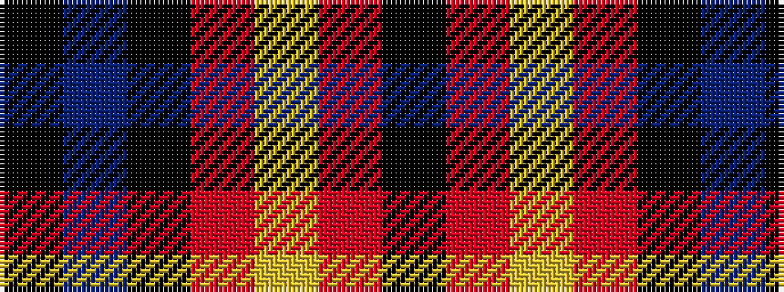

KBKRYRK

It is a 7 stripe tartan.

<figure class="pat-woven">

<figcaption>idealised sample</figcaption>
</figure>

## Colour Sequence



## Tartans with this colour sequence

| Tartans |
|---------------|
| [Benson (New England)](/setts/s7/k16b2k8r3lr3r3k8~x2/)|
||
