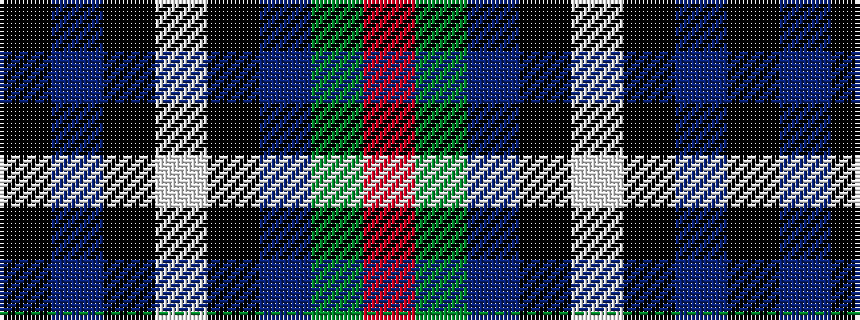

KBKWKBGR

It is a 8 stripe tartan.

<figure class="pat-woven">

<figcaption>idealised sample</figcaption>
</figure>

## Colour Sequence



## Tartans with this colour sequence

| Tartans |
|---------------|
| [Center](/setts/s8/k50db2k13w1k13db5dg15r2~x2/)|
||
| [Center (Name)](/setts/s8/k50b2k13w1k13b5g15r2~x2/)|
||
