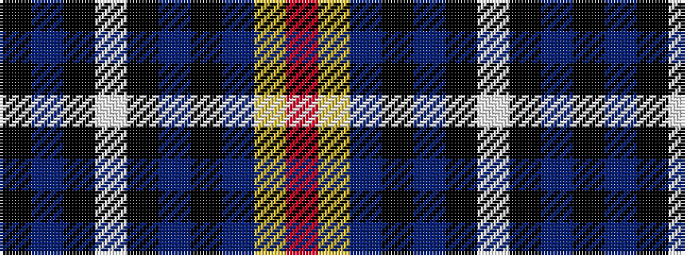

KBKWKBKBYR

It is a 10 stripe tartan.

<figure class="pat-woven">

<figcaption>idealised sample</figcaption>
</figure>

## Colour Sequence



## Tartans with this colour sequence

| Tartans |
|---------------|
| [Estonian National Tartan (District)](/variants/s10/k53b3k2w1k2b3k5b32ly1r3~x2/)|
||
