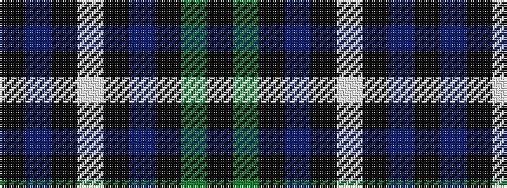

KBKWKBKGK

It is a 9 stripe tartan.

<figure class="pat-woven">

<figcaption>idealised sample</figcaption>
</figure>

## Colour Sequence



## Tartans with this colour sequence

| Tartans |
|---------------|
| [Rainford (Personal)](/setts/s9/k12db10k3lt4k3db10k12dg12k2~x2/)|
||
