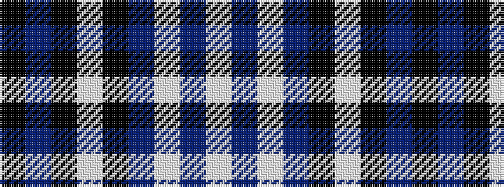

KBKWKBWBW

It is a 9 stripe tartan.

<figure class="pat-woven">

<figcaption>idealised sample</figcaption>
</figure>

## Colour Sequence



## Tartans with this colour sequence

| Tartans |
|---------------|
| [Southern Illinois University - Carbondale](/setts/s9/k5dr40k4w2k4dr10w4dr5w1~x2/)|
||
