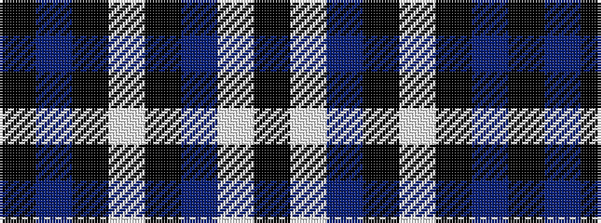

KBKWKBWK

It is a 8 stripe tartan.

<figure class="pat-woven">

<figcaption>idealised sample</figcaption>
</figure>

## Colour Sequence



## Tartans with this colour sequence

| Tartans |
|---------------|
| [Salem Scottish Dancer's Wee Bluet](/setts/s8/k10n10k60w9k7n36w6k6/)|
||
