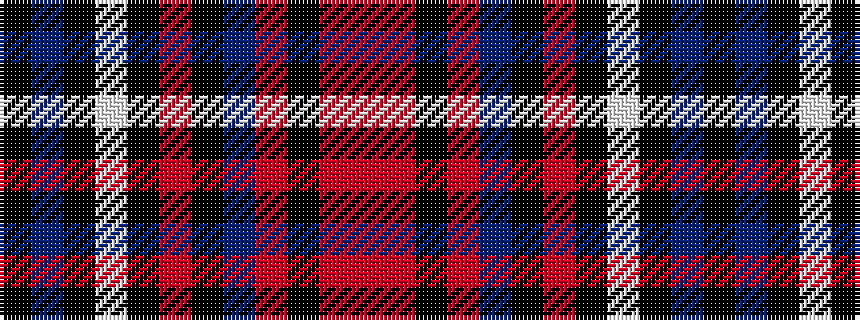

KBKWKRKBRKRR

It is a 12 stripe tartan.

<figure class="pat-woven">

<figcaption>idealised sample</figcaption>
</figure>

## Colour Sequence



## Tartans with this colour sequence

| Tartans |
|---------------|
| [Longmount](/setts/s12/k48n4k6lb2k2r2k2n10o6k2o3r2~x2/)|
||
