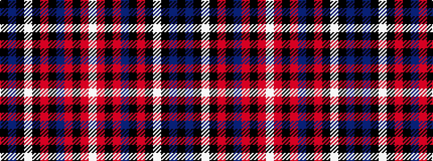

KBKWKRKBRKRW

It is a 12 stripe tartan.

<figure class="pat-woven">

<figcaption>idealised sample</figcaption>
</figure>

## Colour Sequence



## Tartans with this colour sequence

| Tartans |
|---------------|
| [Langtree](/variants/s12/k86n6k4lb3k3r3k3n22o14k3o6lb4/)|
||
