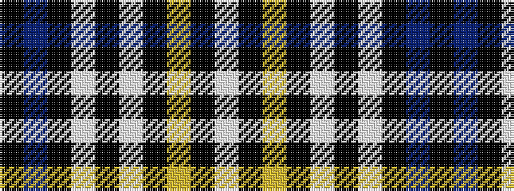

KBKWKWKYKW

It is a 10 stripe tartan.

<figure class="pat-woven">

<figcaption>idealised sample</figcaption>
</figure>

## Colour Sequence



## Tartans with this colour sequence

| Tartans |
|---------------|
| [London Fog Black 2 (fashion)](/variants/s10/k18t9k18lb2k2lb2k18lr9k18lb2/)|
||
