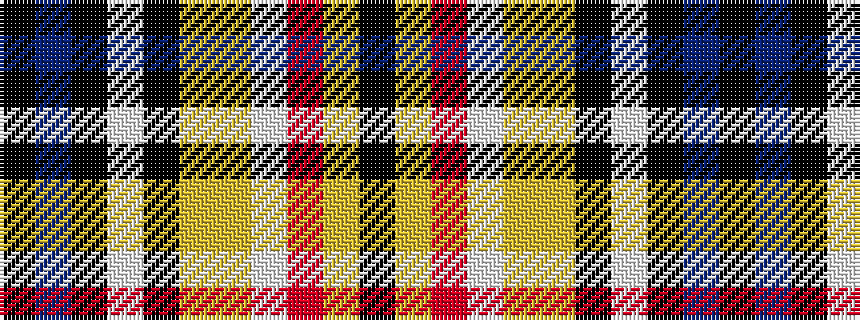

KBKWKYYWRYK

It is a 11 stripe tartan.

<figure class="pat-woven">

<figcaption>idealised sample</figcaption>
</figure>

## Colour Sequence



## Tartans with this colour sequence

| Tartans |
|---------------|
| [State Seal of Georgia (Fashion)](/variants/s11/k10db13k3lb7k1loi20lo3lb13r5loi47k3~x2/)|
||
