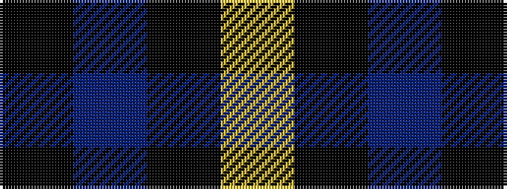

KBKY

It is a 4 stripe tartan.

<figure class="pat-woven">

<figcaption>idealised sample</figcaption>
</figure>

## Colour Sequence



## Tartans with this colour sequence

| Tartans |
|---------------|
| [Wallace (Personal)](/setts/s4/k1db7k7ly1~x10/)|
||
| [Wallace Blue](/setts/s4/k1db8k8ly1/)|
||
