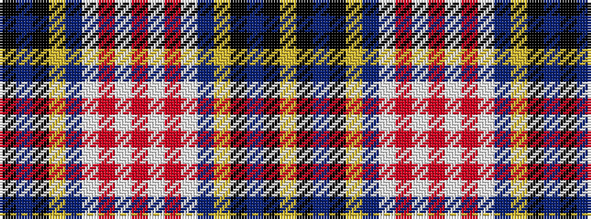

KBKYBWRWRWRWBYKBKY

It is a 18 stripe tartan.

<figure class="pat-woven">

<figcaption>idealised sample</figcaption>
</figure>

## Colour Sequence



## Tartans with this colour sequence

| Tartans |
|---------------|
| [Jong Nederland Born Union, Dress](/setts/s18/k1t2k2lyi2t12w13r1w1r2w1r1w13t12lyi2k2t2k1ly1~x4/)|
||
