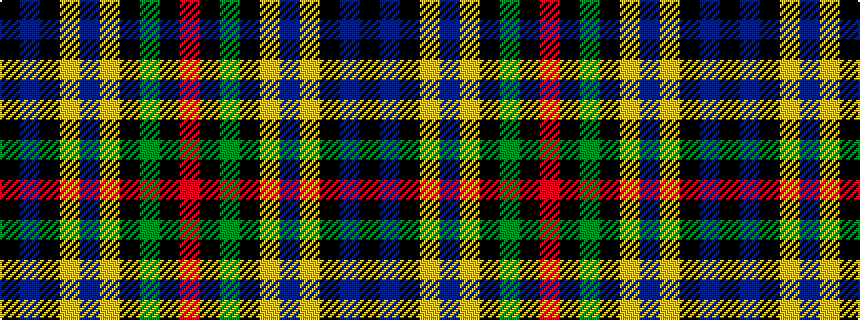

KBKYBYKGKR

It is a 10 stripe tartan.

<figure class="pat-woven">

<figcaption>idealised sample</figcaption>
</figure>

## Colour Sequence



## Tartans with this colour sequence

| Tartans |
|---------------|
| [New Zealand (2003)](/variants/s10/k3db9k2lo5db1lo5k2dg15k1r3~x2/)|
||
