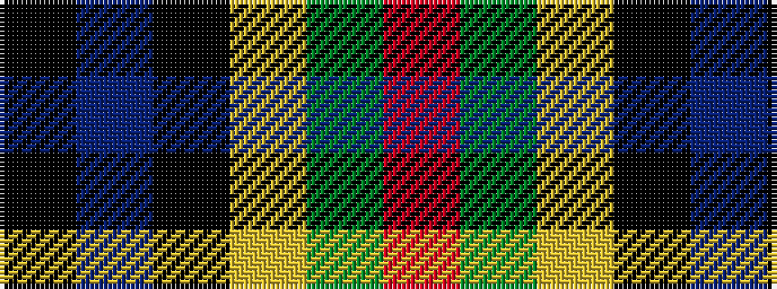

KBKYGR

It is a 6 stripe tartan.

<figure class="pat-woven">

<figcaption>idealised sample</figcaption>
</figure>

## Colour Sequence



## Tartans with this colour sequence

| Tartans |
|---------------|
| [Dahlonega (District)](/variants/s6/r5g18ly2k14t5k4~x2/)|
||
| [Unidentified No 79](/variants/s6/r5dg18ly2k14t5k4~x2/)|
||
