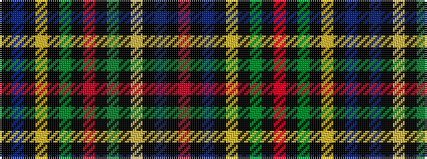

KBKYKGKRKGKYKBKR

It is a 16 stripe tartan.

<figure class="pat-woven">

<figcaption>idealised sample</figcaption>
</figure>

## Colour Sequence



## Tartans with this colour sequence

| Tartans |
|---------------|
| [Strachan](/setts/s16/k3db42k3ly2k3g22k3r2k3g22k3ly2k3db42k3r2~x2/)|
||
