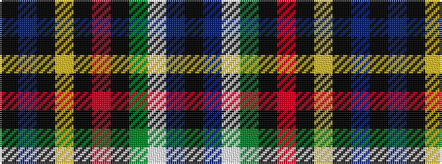

KBKYKRKGWBK

It is a 11 stripe tartan.

<figure class="pat-woven">

<figcaption>idealised sample</figcaption>
</figure>

## Colour Sequence



## Tartans with this colour sequence

| Tartans |
|---------------|
| [State Seal of Wisconsin (Fashion)](/setts/s11/k49db15k2lo6k33r4k3dy8lb3db5k3~x2/)|
||
