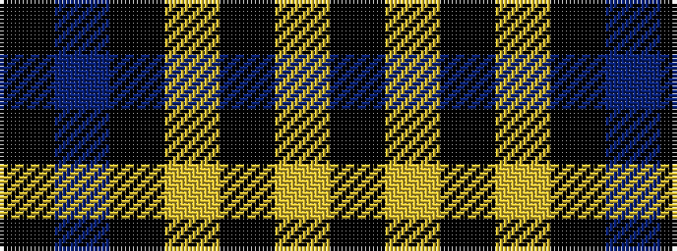

KBKYKYK

It is a 7 stripe tartan.

<figure class="pat-woven">

<figcaption>idealised sample</figcaption>
</figure>

## Colour Sequence



## Tartans with this colour sequence

| Tartans |
|---------------|
| [Lochaber (Hesketh)](/setts/s7/k8ly3k120ly3k40t2k4~x2/)|
||
