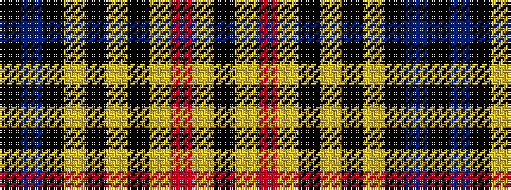

KBKYKYKYRYK

It is a 11 stripe tartan.

<figure class="pat-woven">

<figcaption>idealised sample</figcaption>
</figure>

## Colour Sequence



## Tartans with this colour sequence

| Tartans |
|---------------|
| [Derry County Crest (Fashion)](/variants/s11/k14db22k5lo11k5ly24k11lo11r54lo8k10/)|
||
