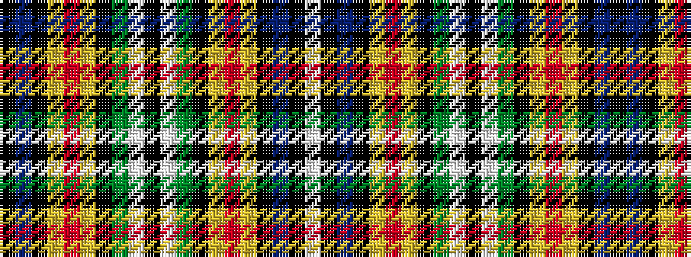

KBKYRYKGWKWGKYRYKBKW

It is a 20 stripe tartan.

<figure class="pat-woven">

<figcaption>idealised sample</figcaption>
</figure>

## Colour Sequence



## Tartans with this colour sequence

| Tartans |
|---------------|
| [Braddock Family (Personal)](/variants/s20/w5k1db2k5ly2r2ly2k30g3w7k4w7g2k30ly2r2ly2k5db2k1~x2/)|
||
