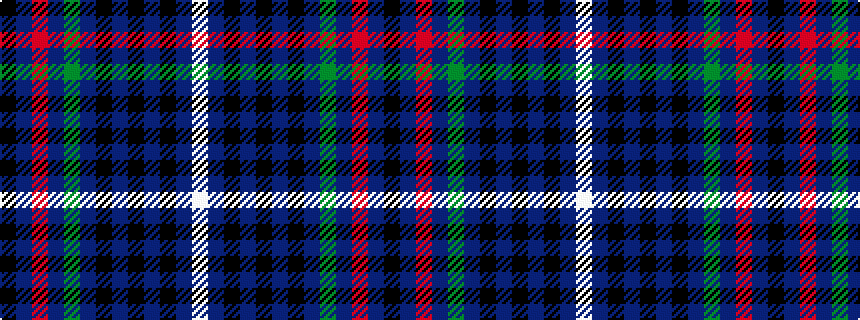

KBRBGBKBKBKBW

It is a 13 stripe tartan.

<figure class="pat-woven">

<figcaption>idealised sample</figcaption>
</figure>

## Colour Sequence



## Tartans with this colour sequence

| Tartans |
|---------------|
| [Spirit of Bannockburn (Fashion)](/variants/s13/k2dp4m4dp3g20dp5k4dp3k7dp3k3db35w2~x2/)|
||
