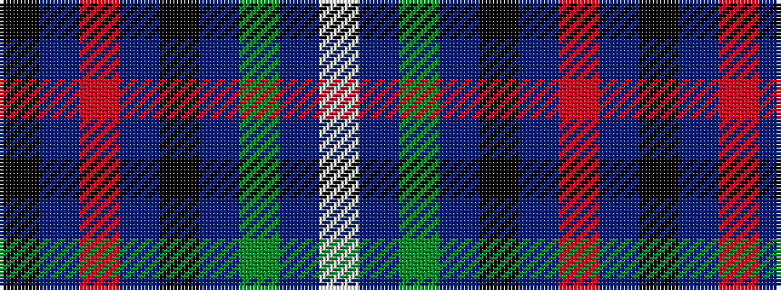

KBRBKBGBW

It is a 9 stripe tartan.

<figure class="pat-woven">

<figcaption>idealised sample</figcaption>
</figure>

## Colour Sequence



## Tartans with this colour sequence

| Tartans |
|---------------|
| [Jethart (District)](/variants/s9/k22b16r3b16k2b16g3b3lb5~x2/)|
||
