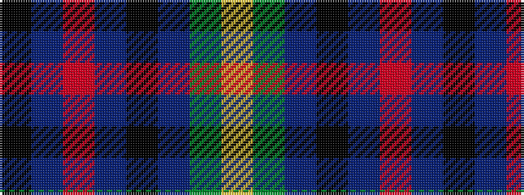

KBRBKBGY

It is a 8 stripe tartan.

<figure class="pat-woven">

<figcaption>idealised sample</figcaption>
</figure>

## Colour Sequence



## Tartans with this colour sequence

| Tartans |
|---------------|
| [Montrose of Alabama](/variants/s8/k12dt12r4dt12k12dt11g12ly4~x2/)|
||
