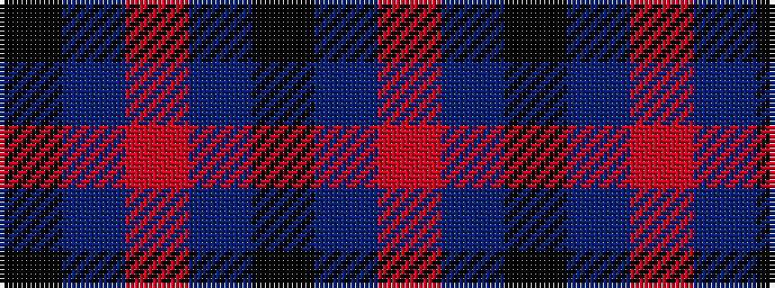

KBRBKBR

It is a 7 stripe tartan.

<figure class="pat-woven">

<figcaption>idealised sample</figcaption>
</figure>

## Colour Sequence



## Tartans with this colour sequence

| Tartans |
|---------------|
| [Edinburgh and Lothian Tourist Board](/setts/s7/k40db8o3db6ki3db6r4~x2/)|
||
