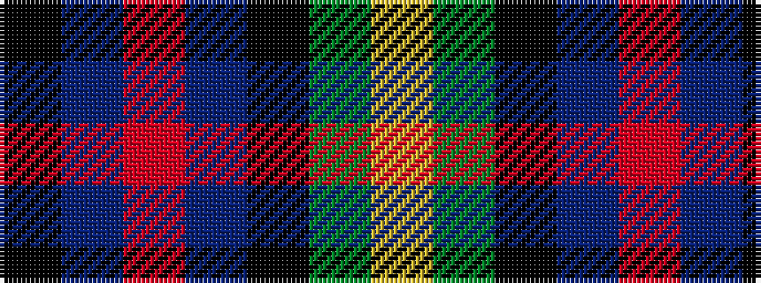

KBRBKGY

It is a 7 stripe tartan.

<figure class="pat-woven">

<figcaption>idealised sample</figcaption>
</figure>

## Colour Sequence



## Tartans with this colour sequence

| Tartans |
|---------------|
| [Melrose of Alabama](/setts/s7/k3db3r1db3k3g3lo1~x8/)|
||
