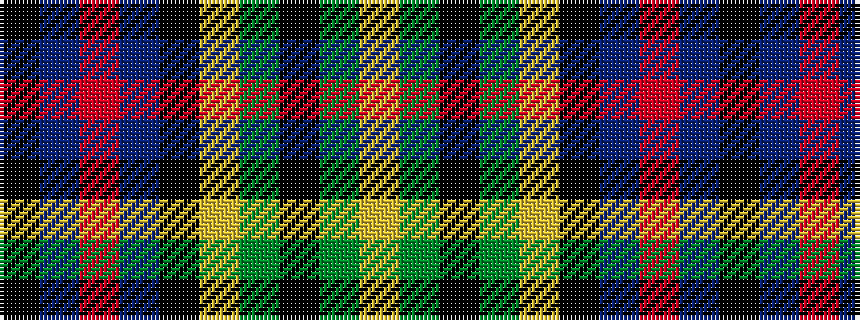

KBRBKYGKGY

It is a 10 stripe tartan.

<figure class="pat-woven">

<figcaption>idealised sample</figcaption>
</figure>

## Colour Sequence



## Tartans with this colour sequence

| Tartans |
|---------------|
| [Forsyth](/setts/s10/k23t25r4t25k23ly2dg25k4dg25ly2~x2/)|
||
| [Forsyth](/setts/s10/k23t25r4t25k23ly2g25k4g25ly4/)|
||
