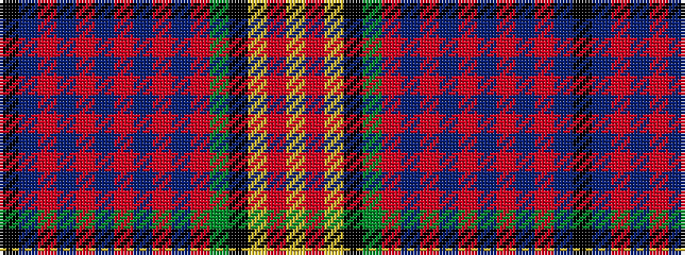

KBRBRBRBRBRGKYRY

It is a 16 stripe tartan.

<figure class="pat-woven">

<figcaption>idealised sample</figcaption>
</figure>

## Colour Sequence



## Tartans with this colour sequence

| Tartans |
|---------------|
| [Catalan Dance](/setts/s16/k2db12r12db2r2t2r2t2r12db6r2dg12k2ly1r1ly1~x2/)|
||
