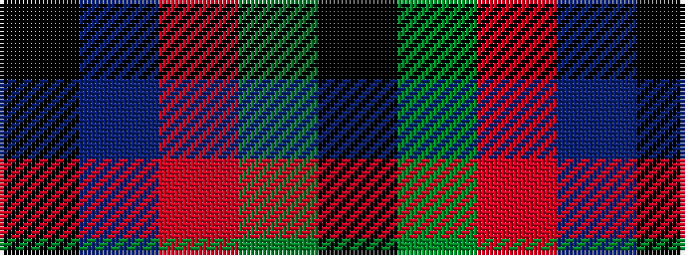

KBRGK

It is a 5 stripe tartan.

<figure class="pat-woven">

<figcaption>idealised sample</figcaption>
</figure>

## Colour Sequence



## Tartans with this colour sequence

| Tartans |
|---------------|
| [All as One (Corporate)](/setts/s5/k11t38r11g11k5~x2/)|
||
| [Edinburgh Military Tattoo 50th](/setts/s5/k1dg8r6db8k1~x4/)|
||
| [Edinburgh Tattoo 50th (Commemorative](/setts/s5/k1db8r6g8k1~x4/)|
||
