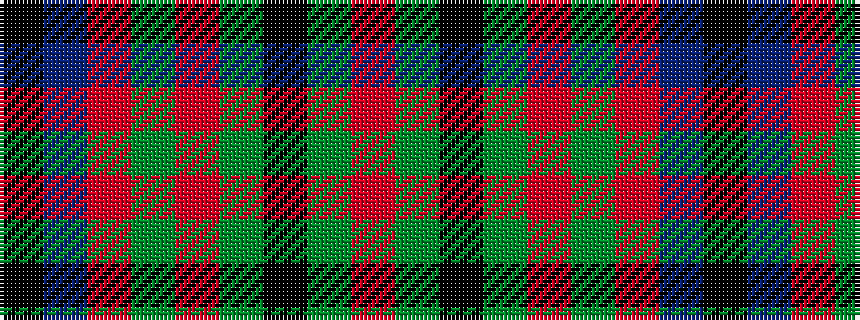

KBRGRGKGR

It is a 9 stripe tartan.

<figure class="pat-woven">

<figcaption>idealised sample</figcaption>
</figure>

## Colour Sequence



## Tartans with this colour sequence

| Tartans |
|---------------|
| [Wcwm 1873-5](/setts/s9/k1db8r1dy3r1dy8k4dg14r1~x4/)|
||
