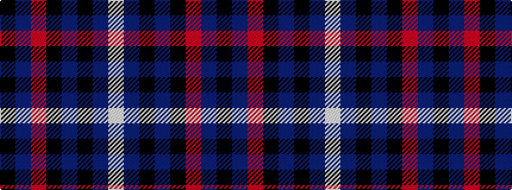

KBRKBKBW

It is a 8 stripe tartan.

<figure class="pat-woven">

<figcaption>idealised sample</figcaption>
</figure>

## Colour Sequence



## Tartans with this colour sequence

| Tartans |
|---------------|
| [Believe - Corinna](/variants/s8/k4dr8m30k8dr6k8dr12w3~x2/)|
||
