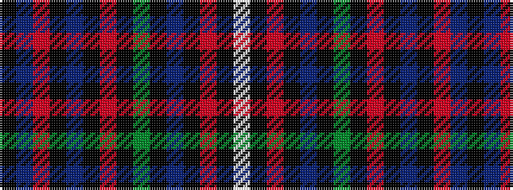

KBRKBKRKGKBKRKW

It is a 15 stripe tartan.

<figure class="pat-woven">

<figcaption>idealised sample</figcaption>
</figure>

## Colour Sequence



## Tartans with this colour sequence

| Tartans |
|---------------|
| [Un-named (D C Dalgliesh)](/setts/s15/k3t4r5k2t5k2r5k2g25k3t11k2r5k1w3~x2/)|
||
