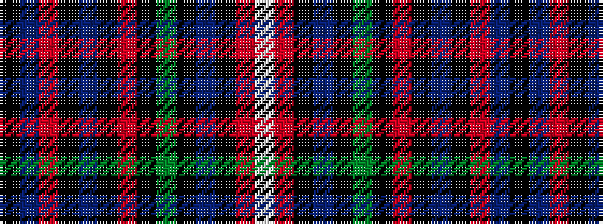

KBRKBKRKGKBKRW

It is a 14 stripe tartan.

<figure class="pat-woven">

<figcaption>idealised sample</figcaption>
</figure>

## Colour Sequence



## Tartans with this colour sequence

| Tartans |
|---------------|
| [Schneidersohne Centenary (Corporate)](/setts/s14/k3t5r5k3t5k3r5k3g20k3t10k3r5w3~x2/)|
||
