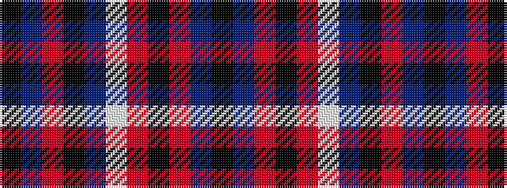

KBRKBWRKRBK

It is a 11 stripe tartan.

<figure class="pat-woven">

<figcaption>idealised sample</figcaption>
</figure>

## Colour Sequence



## Tartans with this colour sequence

| Tartans |
|---------------|
| [Iron Horse Clan Tartan Tartan Number: 3820. Earliest known date: 2002 Designed for members of the Iron Horse 'Clan' (used in the loose sense) a group of American motorcycle enthusiasts wishing to express their identity and heritage through their own tartan. Only for members of the Iron Horse group and their families. See products available Copyright © Blair Urquhart, Comrie, 2015](/setts/s11/k16n4o3k2db1w1r1k2o3n4k12~x4/)|
||
