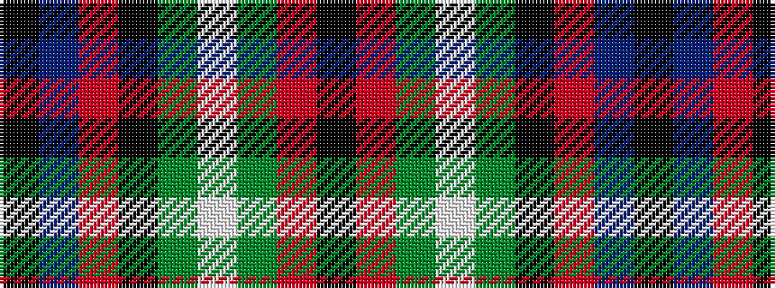

KBRKGWGRK

It is a 9 stripe tartan.

<figure class="pat-woven">

<figcaption>idealised sample</figcaption>
</figure>

## Colour Sequence



## Tartans with this colour sequence

| Tartans |
|---------------|
| [Abercrombie](/setts/s9/k12r1g14w1g14k14r1db8k2~x2/)|
||
| [Abercrombie (McKinlay)](/setts/s9/k12r1dg14w1dg14k14r1db8k2~x2/)|
||
