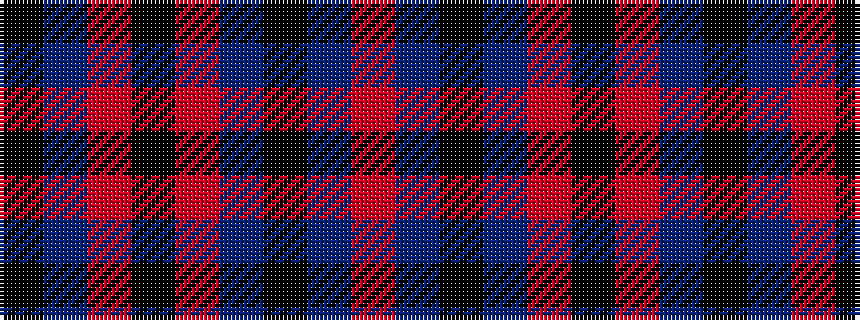

KBRKRBKBR

It is a 9 stripe tartan.

<figure class="pat-woven">

<figcaption>idealised sample</figcaption>
</figure>

## Colour Sequence



## Tartans with this colour sequence

| Tartans |
|---------------|
| [CI (Corporate)](/variants/s9/k100dp8o4k4o4dp8k25db10o4/)|
||
| [Clan Inebriated](/variants/s9/k21dp2o1k1o1dp2k6db2o1~x4/)|
||
| [Clan Inebriated (Corporate)](/variants/s9/k75dp6o2k2o2dp6k12db2o2~x2/)|
||
