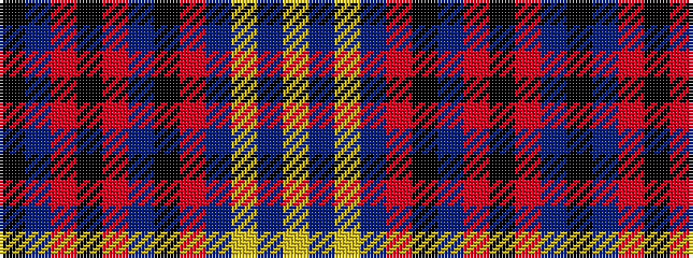

KBRKRBKRBYBY

It is a 12 stripe tartan.

<figure class="pat-woven">

<figcaption>idealised sample</figcaption>
</figure>

## Colour Sequence



## Tartans with this colour sequence

| Tartans |
|---------------|
| [Apache](/setts/s12/k15db7o3k13o3db7k23o3db7ly2dp4ly2~x2/)|
||
