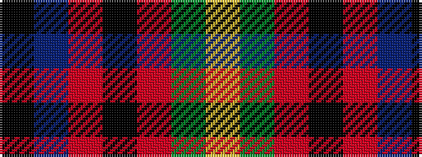

KBRKRGY

It is a 7 stripe tartan.

<figure class="pat-woven">

<figcaption>idealised sample</figcaption>
</figure>

## Colour Sequence



## Tartans with this colour sequence

| Tartans |
|---------------|
| [Nery](/setts/s7/lo6g28r4k20r3db45k5~x2/)|
||
