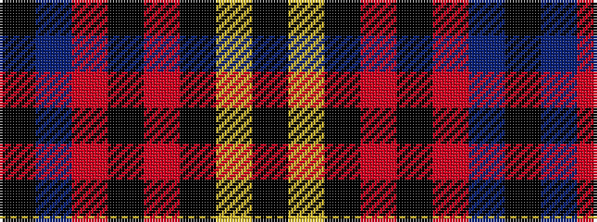

KBRKRKYK

It is a 8 stripe tartan.

<figure class="pat-woven">

<figcaption>idealised sample</figcaption>
</figure>

## Colour Sequence



## Tartans with this colour sequence

| Tartans |
|---------------|
| [Highland Brewing Company](/setts/s8/k42t2r3k5r16k8ly2k3~x2/)|
||
| [Highland Brewing Company (USA)](/setts/s8/k42t2r3k5r16k8lo2k3~x2/)|
||
