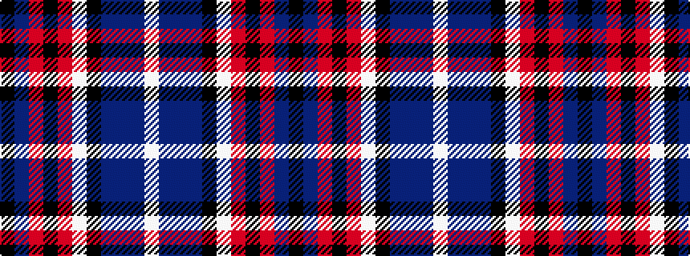

KBRKRWKBBBW

It is a 11 stripe tartan.

<figure class="pat-woven">

<figcaption>idealised sample</figcaption>
</figure>

## Colour Sequence



## Tartans with this colour sequence

| Tartans |
|---------------|
| [Oban Mist](/setts/s11/k8t1o1ki10o16lb2k3n33t1n3w2~x2/)|
||
