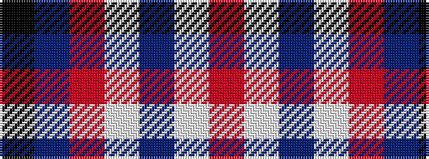

KBRWBWR

It is a 7 stripe tartan.

<figure class="pat-woven">

<figcaption>idealised sample</figcaption>
</figure>

## Colour Sequence



## Tartans with this colour sequence

| Tartans |
|---------------|
| [U.S. Postal Service (Corporate)](/variants/s7/k2t10r5w2db2w2r2~x6/)|
||
