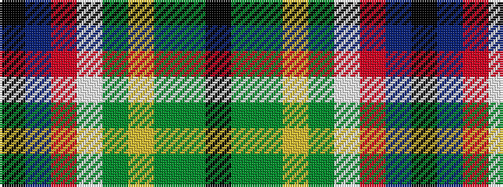

KBRWGYGGK

It is a 9 stripe tartan.

<figure class="pat-woven">

<figcaption>idealised sample</figcaption>
</figure>

## Colour Sequence



## Tartans with this colour sequence

| Tartans |
|---------------|
| [Nor Westers Tartan Tartan Number: 1069. Earliest known date: 1963 Named after the Nor Westers Mountain Range in Ontario. Designed by Miss Evelyn B Halliday in February 1963 to commemorate the naming of the range in that year See products available Copyright © Blair Urquhart, Comrie, 2015](/setts/s9/k1g15dy1ly2dy1w6r1db3k1~x2/)|
||
| [Nor'Westers](/setts/s9/k1g30dy2ly4dy2w12r2b6k1~x2/)|
||
