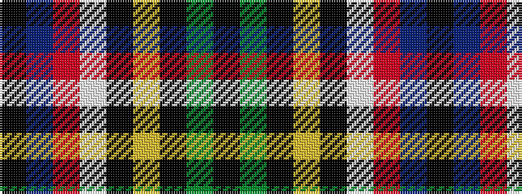

KBRWKYKGK

It is a 9 stripe tartan.

<figure class="pat-woven">

<figcaption>idealised sample</figcaption>
</figure>

## Colour Sequence



## Tartans with this colour sequence

| Tartans |
|---------------|
| [Nor Westers](/variants/s9/k1g23k1ly3k1w8r1t5k1~x2/)|
||
