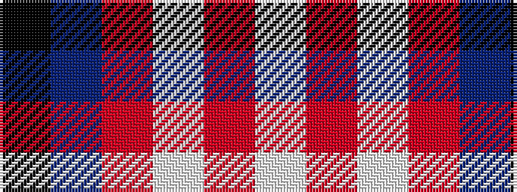

KBRWRW

It is a 6 stripe tartan.

<figure class="pat-woven">

<figcaption>idealised sample</figcaption>
</figure>

## Colour Sequence



## Tartans with this colour sequence

| Tartans |
|---------------|
| [Thompson, D.C. (Personal)](/setts/s6/k4t28r6w12r12w3~x2/)|
||
